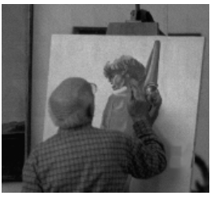
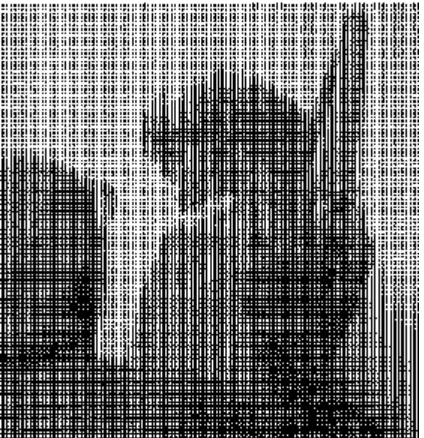
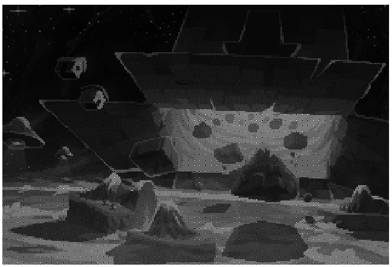
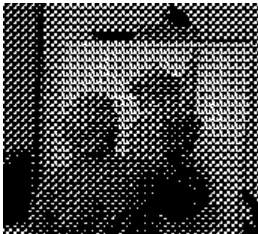
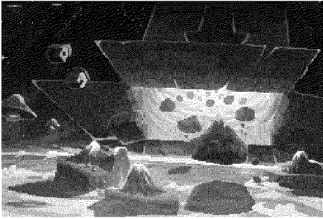

<div style="text-align: center;">
   <h2> PEMROSESAN CITRA DIGITAL</h2>
   <h2> TUGAS INDIVIDU</h2>
</div>

<br>

<div style="text-align: center;">
  
</div>

<br>

<div style="text-align: center;">
     <h5> Nama: </h5><p>Royanur (2310131310006) </p>
     <h5> Dosen Pengampu: </h5>
     <p> Dr. Harja Santana Purba, M.Kom.</p>
     <p> Novan Alkaf Bahraini Saputra, S.Kom., M.T</p>
</div>

<br>

<div style="text-align: center;">
     <p>PROGRAM STUDI PENDIDIKAN KOMPUTER</p>
     <p>FAKULTAS KEGURUAN DAN ILMU PENDIDIKAN</p>
     <p>UNIVERSITAS LAMBUNG MANGKURAT </p>
     <p>2024</p>
</div>

<div style="text-align: center;">
     <h3>Daftar Isi</h3>
</div>


1. **Apa Itu Halftoning?**  
   1.1. Definisi Halftoning  
   1.2. Metode Halftoning Digital  
   
2. **Patterning**  
   2.1. Definisi Patterning  
   2.2. Langkah-langkah Patterning  
       - 2.2.1. Konversi Gambar ke Skala Abu-abu  
       - 2.2.2. Pilih Pola Berdasarkan Intensitas  
       - 2.2.3. Penggantian Piksel dengan Pola  
       - 2.2.4. Output  
   2.3. Cara Perhitungan Patterning  
       - 2.3.1. Konversi Gambar ke Grayscale  
       - 2.3.2. Tentukan Pola yang Akan Digunakan  
       - 2.3.3. Buat Set Pola yang Mewakili Berbagai Tingkat Intensitas  
       - 2.3.4. Gantikan Setiap Piksel dengan Pola yang Sesuai  
   2.4. Contoh Patterning  
       - 2.4.1. Gambar Asli  
       - 2.4.2. Gambar yang Sudah di Patterning  
       - 2.4.3. Contoh Algoritma Patterning  
   2.5. Output Patterning  

3. **Dithering**  
   3.1. Definisi Dithering  
   3.2. Langkah-langkah Dithering  
       - 3.2.1. Konversi Gambar ke Skala Abu-abu  
       - 3.2.2. Pilih Warna Terdekat  
       - 3.2.3. Sebarkan Arsiran ke Piksel Tetangga  
       - 3.2.4. Proses Ulang untuk Setiap Piksel  
   3.3. Cara Perhitungan Dithering  
       - 3.3.1. Ubah Gambar ke Skala Abu-abu  
       - 3.3.2. Cari Warna Terdekat  
       - 3.3.3. Hitung Arsiran  
       - 3.3.4. Sebarkan Arsiran ke Piksel Tetangga  
       - 3.3.5. Perbarui Nilai Piksel Tetangga  
       - 3.3.6. Ulangi untuk Semua Piksel  
   3.4. Contoh Dithering  
       - 3.4.1. Gambar Asli  
       - 3.4.2. Gambar yang Sudah di Dithering  
       - 3.4.3. Contoh Algoritma Dithering  
   3.5. Output Dithering  

4. **Daftar Pustaka**


## Apa Itu Halftoning ?
Halftoning adalah adalah proses yang mensimulasikan corak abu-abu dengan memvariasikan ukuran titik-titik hitam kecil yang tersusun dalam pola yang teratur. Teknik ini digunakan dalam percetakan, serta industri penerbitan.

Halftoning digital mirip dengan halftoning di mana gambar didekomposisi menjadi kisi-kisi sel halftone Elemen (atau titik-titik yang digunakan halftoning dalam mensimulasikan corak abu-abu) dari suatu gambar disimulasikan dengan mengisi sel-sel halftone yang sesuai. Semakin banyak titik hitam dalam sel halftone, semakin gelap sel tersebut tampak.


Ada dua metode untuk menghasilkan gambar halftoning digital yaitu :
- Patterning
- Dithering

## Patterning
  
patterning adalah paling sederhana dari beberapa metode untuk menghasilkan gambar halftoning digital. Teknik ini menghasilkan gambar dengan resolusi spasial lebih tinggi daripada gambar sumber. Jumlah sel halfton pada gambar keluaran sama dengan jumlah piksel pada gambar sumber. Akan tetapi, setiap sel halfton dibagi lagi menjadi ordo 3x3, sehingga hanya bisa merepsentasikan 10 tinggkat intensitas yang berbeda. 

### langkah langkah patterning

- Konversi Gambar ke Skala Abu-abu
  
    Gambar berwarna diubah menjadi gambar skala abu-abu, di mana setiap piksel memiliki nilai intensitas antara 0 (hitam) dan 255 (putih).

- Pilih Pola Berdasarkan Intensitas
  
    Setiap piksel diganti dengan pola yang sesuai berdasarkan tingkat kecerahannya. Piksel yang lebih gelap akan digantikan dengan pola yang lebih padat (banyak titik hitam), sedangkan piksel yang lebih terang akan menggunakan pola yang lebih jarang (banyak titik putih).

- Penggantian Piksel dengan Pola
  
    Setiap piksel diubah menjadi pola berdasarkan nilai intensitasnya. Ini membuat gambar terlihat seperti gradasi meskipun hanya terdiri dari pola hitam-putih.

- Output
  
    Gambar yang dihasilkan terlihat seolah-olah memiliki gradasi dari terang ke gelap, namun sebenarnya tersusun dari pola-pola sederhana yang menggantikan intensitas piksel asli.

### cara perhitungan patterning
- Konversi Gambar ke Grayscale:

    Langkah pertama adalah mengubah gambar berwarna menjadi grayscale, di mana setiap piksel memiliki intensitas di antara 0 (hitam) hingga 255 (putih).

    Contoh: Jika sebuah gambar awalnya berwarna, maka intensitas piksel I untuk grayscale bisa dihitung menggunakan rumus:

    I = 0.299⋅R+0.587⋅G+0.114⋅B Di mana R, G, dan 𝐵 adalah komponen merah, hijau, dan biru dari gambar berwarna.

- Tentukan Pola yang Akan Digunakan:

    Setiap nilai intensitas piksel digantikan oleh pola (seperti grid titik-titik atau bentuk tertentu) yang mencerminkan tingkat kecerahan. 
    
    Misalnya:
    Intensitas piksel rendah (gelap) diwakili oleh pola padat (misalnya lebih banyak titik hitam).
    Intensitas piksel tinggi (terang) diwakili oleh pola jarang atau sedikit titik.

- Buat Set Pola yang Mewakili Berbagai Tingkat Intensitas:

    Pola ini bisa berupa matriks 2x2, 3x3, atau ukuran yang lebih besar, tergantung pada seberapa detail gambar yang ingin dihasilkan. Setiap pola mewakili rentang tertentu dari intensitas grayscale.

    Contoh pola 2x2 untuk patterning:

    Untuk piksel yang sangat gelap (intensitas mendekati 0):

    [11
     11]

    Untuk piksel dengan intensitas menengah:

    [10
     01]

    Untuk piksel terang (intensitas mendekati 255):

    [00
     00]

    Di sini "1" mewakili titik hitam, dan "0" mewakili titik putih. Pola ini bertujuan untuk menciptakan ilusi kecerahan atau gelap berdasarkan pola tersebut.

- Gantikan Setiap Piksel dengan Pola yang Sesuai

    Setelah menentukan pola yang sesuai untuk setiap rentang intensitas, kalian menggantikan setiap piksel pada gambar asli dengan pola tersebut. Misalnya, jika sebuah piksel memiliki intensitas 
    I=80 (cukup gelap), kalian akan menggantinya dengan pola yang lebih padat.


### contoh patterning

#### gambar asli
<div style="text-align: center; ">
  
</div>

<br>

#### gambar yang sudah di patterning
<div style="text-align: center; width:100%;">
  
</div>


### Contoh algoritma patterning
```
% Baca gambar
image = imread('gambar2.jpg');

% Cek apakah gambar memiliki 3 saluran (RGB)
if size(image, 3) == 3
  % Jika gambar RGB, konversi ke grayscale
  grayscale_image = rgb2gray(image);
else
  % Jika gambar sudah grayscale
  grayscale_image = image;
end

% Ukuran dari pola (pattern)
pattern_size = 2;  % 2x2 pola sederhana

% Tentukan pola yang akan digunakan
pattern = [
  0 1;
  1 0
]; % Pola checkerboard sederhana

[rows, cols] = size(grayscale_image);
pattern_image = zeros(rows, cols);

% Terapkan pola ke setiap piksel
for i = 1:rows
  for j = 1:cols
    % Intensitas piksel grayscale
    intensity = grayscale_image(i, j);

    % Terapkan pola checkerboard
    pattern_image(i, j) = pattern(mod(i-1, pattern_size)+1, mod(j-1, pattern_size)+1) * intensity;
  end
end

% Normalisasi manual gambar ke rentang [0, 255]
min_val = min(pattern_image(:));
max_val = max(pattern_image(:));
pattern_image = (pattern_image - min_val) / (max_val - min_val) * 255;
pattern_image = uint8(pattern_image);  % Konversi ke uint8

% Tampilkan gambar hasil patterning
imshow(pattern_image);

```      

### output patterning
<div style="text-align: center; ">
  
</div>


## Dithering

Dithering tidak seperti patterning, menggunakan pola biner untuk menciptakan ilusi gradasi warna. Teknik ini menggantikan gradasi abu-abu dengan pola titik-titik kecil yang diatur sedemikian rupa untuk menciptakan kesan variasi kecerahan.

### langkah langkah dithering
- Konversi Gambar ke Skala Abu-abu
  
    Seperti patterning, gambar diubah menjadi skala abu-abu, di mana setiap piksel memiliki nilai antara 0 dan 255.

- Pilih Warna Terdekat

    Setiap piksel dipaksa untuk memilih warna terdekat dari palet yang tersedia. Misalnya, jika hanya ada dua warna (hitam dan putih), kita tentukan apakah intensitas piksel lebih dekat ke hitam (0) atau putih (255).

- Sebarkan arsiran ke Piksel Tetangga

    arsiran yang dihasilkan disebarkan ke piksel-piksel di sekitar menggunakan pola distribusi tertentu. Dalam metode Floyd-Steinberg, distribusi arsiran dilakukan sebagai berikut:

              X   7/16

        3/16 5/16 1/16


    Artinya, 7/16 dari arsiran diberikan ke piksel di sebelah kanan, 3/16 ke piksel di bawah kiri, 5/16 ke piksel tepat di bawah, dan 1/16 ke piksel di bawah kanan.

- Proses Ulang untuk Setiap Piksel

    Langkah ini diulang untuk setiap piksel dalam gambar. Setiap kali sebuah piksel diproses, error-nya disebarkan ke piksel di sekitarnya.

- Output

    Hasil akhir adalah gambar yang hanya menggunakan warna-warna dari palet yang tersedia, tetapi terlihat halus karena distribusi arsiran. Meskipun gambarnya hanya terdiri dari dua warna (hitam dan putih), penyebaran arsiran membuat gambar terlihat seperti memiliki gradasi yang lebih alami.

### cara perhitungan dithering
- Ubah Gambar ke Skala Abu-abu
  
    Setiap piksel dalam gambar grayscale memiliki nilai intensitas antara 0 (hitam) hingga 255 (putih). Misalkan ada sebuah gambar dengan piksel intensitas abu-abu, kita akan mengubahnya menjadi gambar dengan hanya dua warna (hitam atau putih).

- Cari Warna Terdekat

    Untuk setiap piksel, tentukan warna terdekat. Jika intensitas piksel 𝐼 ≥ 128, warna terdekat adalah putih (255). Jika 𝐼 < 128, warna terdekat adalah hitam (0). 
    
    Contoh: 
    
    Misalkan intensitas piksel 𝐼 = 180. Karena 180 ≥ 128, warna terdekat adalah putih (255).

- Hitung arsiran 
  
    arsiran adalah selisih antara intensitas asli piksel dengan warna terdekat.
    arsiran = I (original) − I (nearest)

    Contoh:

    Jika I=180 dan warna terdekat adalah 255 (putih), 
    maka arsiranya: arsiran = 180−255= −75

- Sebarkan arsiran ke Piksel Tetangga
  
     arsiran ini akan disebarkan ke piksel-piksel tetangga berdasarkan pola dan bobot distribusi Floyd-Steinberg.

     polanya :
     
                       X      7/16

               3/16   5/16    1/16

    - 7/16 diberikan ke piksel di sebelah kanan.
    - 3/16 diberikan ke piksel di kiri bawah.
    - 5/16 diberikan ke piksel di bawah.
    - 1/16 diberikan ke piksel di kanan bawah.
  
​
    Contoh Distribusi arsiran
    arsiran sebesar -75 dihitung dan disebarkan ke piksel-piksel tetangga sesuai bobotnya:

    - Piksel sebelah kanan menerima arsiran Kanan = −75×16/7 = −32.8125.

    - Piksel kiri bawah menerima arsiran Kiri Bawah = -75×3/16= − 14.0625.

    - Piksel bawah menerima arsiran Bawah = −75×5/16 = − 23.4375.
  
    - Piksel kanan bawah menerima arsiran Kanan Bawah = −75×1/16 = − 4.6875

- Perbarui Nilai Piksel Tetangga
  
    Piksel-piksel tetangga diperbarui dengan menambahkan arsiran yang telah didistribusikan. Misalkan piksel sebelah kanan awalnya memiliki intensitas 150, setelah penambahan arsiranya, intensitas barunya menjadi:

    I (baru) = I (lama) + arsiran Kanan=150+(−32.8125)=117.1875

    Piksel lainnya juga diperbarui dengan cara yang sama.

- Ulangi untuk Semua Piksel 
  
    Proses ini diulangi untuk setiap piksel di gambar hingga seluruh gambar telah diproses.

### contoh dithering

#### gambar asli
<div style="text-align: center; ">
  
</div>

<br>

#### gambar yang sudah di dithering
<div style="text-align: center; width:100%;">
  
</div>

### contoh algoritma dithering

```
% Baca gambar
image = imread('image.jpg');

% Cek apakah gambar memiliki 3 saluran (RGB)
if size(image, 3) == 3
  % Jika gambar RGB, konversi ke grayscale
  grayscale_image = rgb2gray(image);
else
  % Jika gambar sudah grayscale
  grayscale_image = image;
end

% Konversi gambar grayscale menjadi tipe double untuk perhitungan
dithered_image = double(grayscale_image);

[rows, cols] = size(dithered_image);

% Algoritma Floyd-Steinberg Dithering
for i = 1:rows
  for j = 1:cols
    old_pixel = dithered_image(i, j);
    % Kuantisasi pixel menjadi 0 atau 255
    new_pixel = round(old_pixel / 255) * 255;
    dithered_image(i, j) = new_pixel;
    
    % Hitung error kuantisasi
    error = old_pixel - new_pixel;
    
    % Sebarkan error ke tetangga berdasarkan Floyd-Steinberg kernel
    if j+1 <= cols
      dithered_image(i, j+1) = dithered_image(i, j+1) + error * 7/16;
    end
    if i+1 <= rows && j-1 >= 1
      dithered_image(i+1, j-1) = dithered_image(i+1, j-1) + error * 3/16;
    end
    if i+1 <= rows
      dithered_image(i+1, j) = dithered_image(i+1, j) + error * 5/16;
    end
    if i+1 <= rows && j+1 <= cols
      dithered_image(i+1, j+1) = dithered_image(i+1, j+1) + error * 1/16;
    end
  end
end

% Konversi kembali ke uint8 agar dapat ditampilkan dengan benar
dithered_image = uint8(dithered_image);

% Tampilkan gambar hasil dithering
imshow(dithered_image);
```

### output dithering
<div style="text-align: center; ">
  
</div>


## Daftar Pustaka

Gonzalez, R. C., & Woods, R. E. (2018). Digital image processing (4th ed.). Pearson.

Konrad, I. (n.d.). Introduction to digital image processing. Retrieved from https://people.ece.ubc.ca/irenek/techpaps/introip/manual04.html


